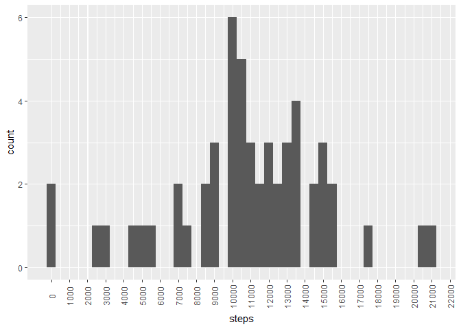
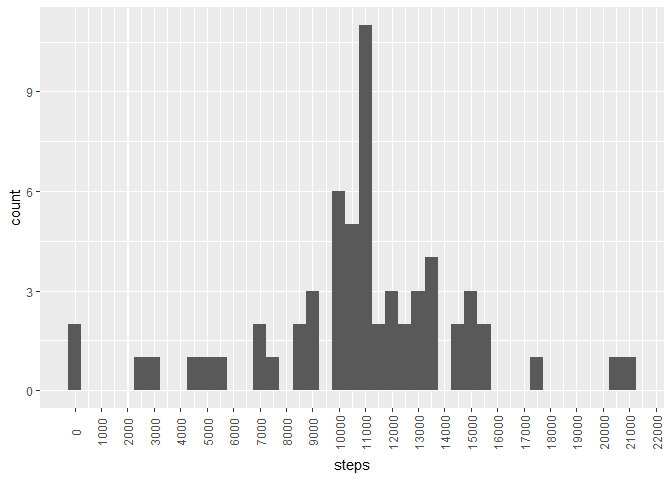
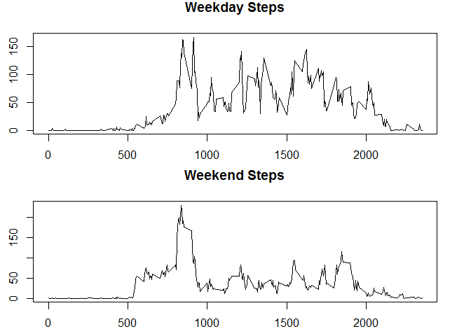

# Reproducible Research: Peer Assessment 1


## 1) Code for reading in the dataset and/or processing the data


```r
dataFile<-"activity.csv"
data<-read.table(dataFile, header=TRUE, sep=",", stringsAsFactors=FALSE, dec=".")
```

## 2) Histogram of the total number of steps taken each day


```r
dailysteps<-aggregate(steps~date,data,sum)
```


```r
library(ggplot2)
ggplot(dailysteps,aes(steps))+geom_histogram(binwidth=500)+scale_x_continuous(minor_breaks = seq(1,25000,500),breaks = seq(0,25000,1000))+theme(axis.text.x=element_text(angle = 90, vjust = 0.5))
```

<!-- -->

## 3) Mean and median number of steps taken each day


```r
mean(dailysteps$steps)
```

```
## [1] 10766.19
```

```r
median(dailysteps$steps)
```

```
## [1] 10765
```

## 4) Time series plot of the average number of steps taken


```r
intervalsteps<-aggregate(steps~interval,data,mean)
```


```r
with(intervalsteps,plot(interval,steps,type="l"))
```

<!-- -->

## 5) The 5-minute interval that, on average, contains the maximum number of steps

```r
subset(intervalsteps,steps==max(steps))$interval
```

```
## [1] 835
```

## 6) Code to describe and show a strategy for imputing missing data

    + Calculate and report the total number of missing values in the dataset (i.e. the total number of rows with NAs)
    + Devise a strategy for filling in all of the missing values in the dataset. The strategy does not need to be sophisticated. For example, you could use the mean/median for that day, or the mean for that 5-minute interval, etc.
    + Create a new dataset that is equal to the original dataset but with the missing data filled in.
    + Make a histogram of the total number of steps taken each day and Calculate and report the mean and median total number of steps taken per day. Do these values differ from the estimates from the first part of the assignment? What is the impact of imputing missing data on the estimates of the total daily number of steps?

***
First, I will calculate the total number of missing values.

```r
sum(is.na(data$steps))
```

```
## [1] 2304
```
***
For these values I will substitute in the mean number of steps taken for that time interval.


```r
newdata<-merge(data,intervalsteps,by="interval")
newdata$steps.x[is.na(newdata$steps.x)]<-newdata$steps.y[is.na(newdata$steps.x)]
```
## 7) Histogram of the total number of steps taken each day after missing values are imputed:

```r
newdailysteps<-aggregate(newdata$steps.x~newdata$date,newdata,sum)
```


```r
ggplot(newdailysteps,aes(newdailysteps$`newdata$steps.x`))+geom_histogram(binwidth=500)+scale_x_continuous(minor_breaks = seq(1,25000,500),breaks = seq(0,25000,1000))+theme(axis.text.x=element_text(angle = 90, vjust = 0.5))+xlab("steps")
```

<!-- -->


```r
mean(newdailysteps$`newdata$steps.x`)
```

```
## [1] 10766.19
```

```r
median(newdailysteps$`newdata$steps.x`)
```

```
## [1] 10766.19
```

## 8) Panel plot comparing the average number of steps taken per 5-minute interval across weekdays and weekends


```r
newdata$daytype<-ifelse(weekdays(as.Date(newdata$date))%in%c("Saturday","Sunday"),"Weekend","Weekday")
wknewdata<-newdata[newdata$daytype=="Weekday",]
wdnewdata<-newdata[newdata$daytype=="Weekend",]
weekendsteps<-aggregate(steps.x~interval,wknewdata,mean)
weekdaysteps<-aggregate(steps.x~interval,wdnewdata,mean)
par(mfrow=c(2,1),pin=c(6,1.5))
with(weekdaysteps,plot(interval,steps.x,type="l",main="Weekday Steps",ylab = "steps"))
with(weekendsteps,plot(interval,steps.x,type="l",main="Weekend Steps",ylab = "steps"))
```

<!-- -->
